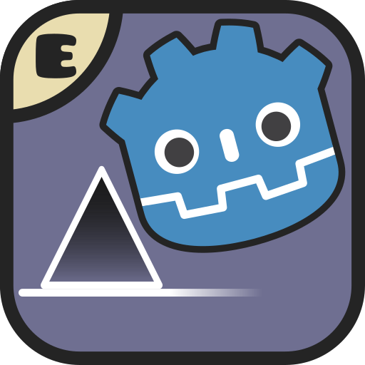

 </img>
 <h1 align="center">Godot Dash</h1>

A Geometry Dash fangame made with Godot Engine.

[Discord community](https://discord.gg/8Vn9qDDXZD)

[Credits](./CREDITS.md)

## OS Support

Godot Dash is intended to work on Linux, Windows, and Android.

## Downloads

Head to the [releases](https://codeberg.org/godot-dash/godot-dash/releases/) section and download the latest one.

## Compilation

**⚠️ Make sure to use Godot 4.7. ⚠️**

### Dependencies

- [`git-lfs`](https://github.com/git-lfs/git-lfs#installing)

This project is written entirely in GDScript, so no additional toolchains or native extensions need to be compiled.

#### Godot Android export

See https://docs.godotengine.org/en/stable/tutorials/export/exporting_for_android.html.

- [`OpenJDK`](https://openjdk.org/install)
- [`Android SDK`](https://developer.android.com/studio)

### Instructions

- Run `git lfs install` if you haven't done so already.
- Clone the repo locally.
- Import the project.godot file.
- Go to `Project → Export` and select the export preset you want.
- Choose an export path.
- Hit `Export Project`.

## Geometry Dash objects

Imported `.gmd` levels draw Geometry Dash's own artwork. The pipeline lives in `tools/`:

| Step | Command | Output |
| --- | --- | --- |
| 1. Object table | `python3 tools/build_object_frames.py --id-list tools/gd_object_id_list.txt` | `assets/textures/gd_atlas/object_frames.json` (object id → sprites, default z layer/order) |
| 2. Godot atlas | `python3 tools/build_godot_atlas.py` | `assets/textures/gd_atlas/gd_objects_atlas_*.png` + `.json` — the cocos2d `-hd` sheets from `assets/textures/gd_atlas/source/` repacked into 4096² pages, rotated frames turned upright |
| 3. Object scenes | `python3 tools/build_gd_object_scenes.py` | `scenes/gd_objects/gd_<id>.tscn`, one scene per object type |

Each `gd_<id>.tscn` has the object's sprites laid out under `Base` / `Detail`, an empty `Collision`
(`StaticBody2D`, layer 2 = solids) with a `Hitbox` placeholder, and an editor selection box. Open one
in Godot and add the collision shapes you want; every placement of that object type in every level
gets them. Re-running step 3 refreshes the artwork but keeps your `Collision` subtree and the scene UID.

At runtime `Level` instances the type's scene once per placement (`GDObject`). Object types with no
scene fall back to the batched renderer (`DecorationBatch`). While a level plays, `CullingManager`
hides objects beyond a buffer around the camera (Settings → Graphics → Performance → *Culling buffer*,
in cells) so a sudden speed change never shows a gap.

## Runtime performance

The optional GDExtension (`native/`) carries the hot paths that per-object GDScript cannot: the packed
trigger scheduler, the retained-RID decoration renderer with worker-thread culling, the node visibility
index, incremental level construction, shared-physics shape commits — and, since 1.10, colour-channel
propagation (`NativeColorChannelIndex`): one native call repaints every `HSVWatcher` of a channel, which
colour-pulse-heavy levels previously paid as a per-object GDScript call with ~15 property accesses each
animation frame. Source/editor builds without the extension keep the equivalent GDScript paths.

Per-frame GDScript is kept lean as well: the 240 Hz player loop resolves its scene nodes through cached
references instead of `$Path` lookups, and idle interactable components (easings, rebounds, music-pulse
scales, toggle sprites) only process while a tween is live or the player is within interaction range.

Steps 1–2 need Python 3 and Pillow (`pip install pillow`).

## Contributing

**⚠️ Make sure to use Godot 4.7. ⚠️**

### Dependencies

See *Compilation*.

### Instructions

- **Read [CONTRIBUTING.md](./CONTRIBUTING.md).**
- Run `git lfs install` if you haven't done so already.
- Clone the repo and import it in Godot.
- Open a PR with your changes.
